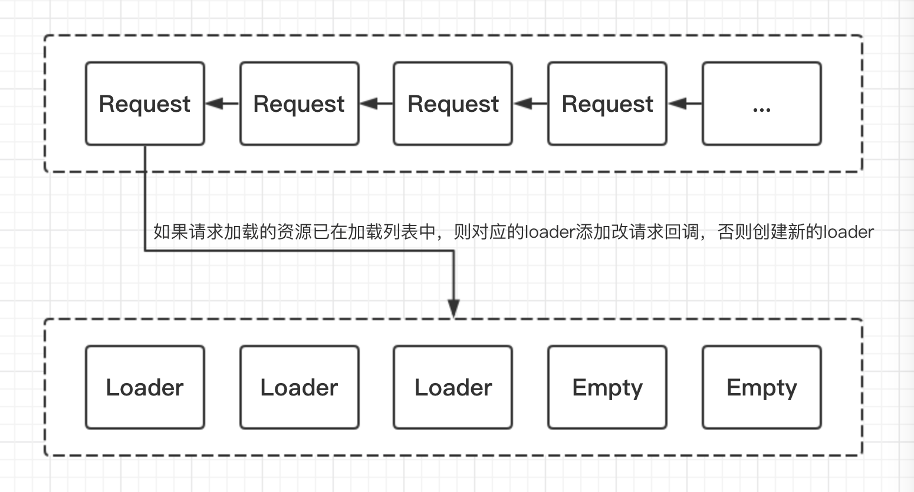

# 资源加载

### Unity资源加载方式
* Resources：[官方不推荐](https://unity3d.com/cn/learn/tutorials/topics/best-practices/resources-folder)
* AssetBundle：[官方介绍](https://docs.unity3d.com/Manual/AssetBundlesIntro.html)
* AssetDataBase: 编辑模式下
    
### 同步加载
* 编辑器模式下：UnityEditor.AssetDatabase.LoadAssetAtPath
* AssetBundle同步加载：1.根据AssetBundleManifest，同步加载自身及所有依赖的AssetBundle(LoadFromFile) 2.根据加载出来的AssetBundle同步加载对应资源(LoadAsset)

#### 同步加载AssetBundle核心代码
~~~C#
    /// 

    /// 同步加载所有依赖Bundle
    /// 

    /// <param name="path">Path.</param>
    public AssetBundle SyncLoadAllAssetBundle(string path)
    {
        var manifest = GetAssetBundleManifest();
        var assetBundleName = PathToBundle(path);
        var dependencies = manifest.GetAllDependencies(assetBundleName);
        foreach (var depend in dependencies)
        {
            SyncLoadAssetBundle(depend);
        }
        return SyncLoadAssetBundle(assetBundleName);
    }

    /// 

    /// 根据AB包名同步加载AssetBundle
    /// 

    private AssetBundle SyncLoadAssetBundle(string assetBundleName)
    {
        AssetBundleUnit unit = null;
        if (!mAssetBundleUnitDict.TryGetValue(assetBundleName, out unit))
        {
            var path = PathUtil.GetLocalAssetBundleFilePath(assetBundleName);
            var assetBundle = AssetBundle.LoadFromFile(path);
            if (assetBundle == null)
            {
                Debugger.LogError("Load AssetBundle Error: " + assetBundleName);
                return null;
            }
            unit = mAssetBundleUnitPool.Spawn();
            unit.AssetBundle = assetBundle;
            unit.RefCount++;
            mAssetBundleUnitDict.Add(assetBundleName, unit);
        }
        else
        {
            unit.RefCount++;
        }
        return unit.AssetBundle;
    }
~~~

### 异步加载
* 编辑器模式下：还是使用同步加载(可以加点延时模拟)
* AssetBundle异步加载：1.发起异步加载请求，加入到异步加载请求队列中 2.实时处理请求队列和正在加载队列 3.每个资源要等自身所有的AssetBundle异步加载完成时，才开始异步加载资源

### 异步加载请求队列和正在加载队列

### 异步加载核心代码
~~~C#
    /// 

    /// 检测
    /// 

    private void Update()
    {
        DealAssetBundleLoadQueue();
        CheckAssetRequestQueue();
        DealAssetLoadingQueue();
    }

    /// 

    /// 检测请求队列中的资源，并加入到要加载的队列中
    /// 

    private void CheckAssetRequestQueue()
    {
        if (mAssetRequestQueue.Count == 0) return;
        // 正在加载的资源达到上限
        if (mAssetLoadingQueue.Count >= MAXLOADNUM) return;
        // 按优先级排序
        mAssetRequestQueue.Sort();
        while (mAssetLoadingQueue.Count < MAXLOADNUM)
        {
            if (mAssetRequestQueue.Count == 0) break;

            // 从请求队列中拿一个加入到加载队列中
            var request = mAssetRequestQueue[0];
            mAssetRequestQueue.RemoveAt(0);
            AssetLoader loader;
            if (mAssetLoadingQueue.TryGetValue(request.Path, out loader))
            {
                // 如果请求加载的资源在请求队列中，就增加回调
                loader.AddCallback(request.Callback);
            }
            else
            {
                loader = mAssetLoaderPool.Spawn();
                loader.Path = request.Path;
                loader.AddCallback(request.Callback);
                mAssetLoadingQueue.Add(request.Path, loader);
            }
            request.Dispose();
            mAssetLoadRequestPool.Recycle(request);
        }
    }

    /// 

    /// 处理正在加载队列
    /// 

    public void DealAssetLoadingQueue()
    {
        foreach(var loader in mAssetLoadingQueue.Values)
        {
            if (loader.CanLoadAssetAsync())
            {
                StartCoroutine(loader.AsyncLoadAsset());
            }
        }
    }

    /// 

    /// 处理AssetBundle异步加载队列
    /// 

    private void DealAssetBundleLoadQueue()
    {
        foreach(var loader in mAssetBundleLoaderQueue.Values)
        {
            if (!loader.IsLoading)
            {
                StartCoroutine(loader.AsyncLoadAssetBundle());
            }
        }
    }
~~~