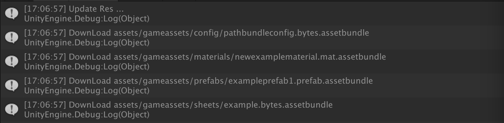

# 热更新
* [构建本地热更新静态资源服务器](../../Server/STATIC.md)
* 将StreamingAssets目录下的资源上传服务器(示例中只用拷到Server/public下)
* Tools->AssetBundle->Upload
* 加载本地和服务器上的版本配置文件进行对比。版本有差异，则加载本地和服务器上的AssetBundleManifest，对比资源Hash, 把差异和新增资源加入到下载列表中。加载完成后写入Application.persistentDataPath。

## 热更新核心代码
~~~C#
/// 

/// 检查更新，包括大版本换包和热更新
/// 

private IEnumerator CheckUpdate()
{
    // 是否开启热更检测
    if (!AppConfig.CheckVersionUpdate)
    {
        StartGame();
        yield break;
    }
    // 加载并初始化版本信息文件
    yield return InitVersion();

    // 没有版本对比文件，直接进入游戏
    if (mLocalVersionConfig == null || mServerVersionConfig == null)
    {
        StartGame();
        yield break;
    }

    // 检测版本配置文件
    if (CheckVersion(mLocalVersionConfig.Version, mServerVersionConfig.Version))
    {
        // 对比版本资源
        yield return CompareVersion();
    }
    if (mNeedDownLoadQueue.Count == 0)
    {
        StartGame();
    }
    else
    {
        DownLoadResource();
    }
}

/// 

/// 下载资源
/// 

private void DownLoadResource()
{
    if (mNeedDownLoadQueue.Count == 0)
    {
        UpdateVersionConfig();
        StartGame();
        return;
    }
    var abName = mNeedDownLoadQueue.Dequeue();
    Debugger.Log(StringUtil.Concat("DownLoad ", abName));
    var abPath = StringUtil.PathConcat(AssetBundleConfig.AssetBundlesFolder, abName);
    var url = PathUtil.GetServerFileURL(abPath);
    StartCoroutine(DownLoad(url, abName));
}

/// 

/// 下载资源
/// 

IEnumerator DownLoad(string url, string abName)
{
    var www = new WWW(url);
    yield return www;
    if (string.IsNullOrEmpty(www.error))
    {
        ReplaceLocalResource(abName, www.bytes);
    }
    www.Dispose();
    DownLoadResource();
}
~~~

## 热更新测试
* 修改Example表格数据，新增材质NewExampleMaterial，同时修改ExamplePrefab1的关联材质为新材质
* 预期的热更AssetBundle：1.Example表格AB 2.新增的NewExampleMaterial材质AB 3.ExamplePrefab1预制体AB 4 路径和AssetBundle对应的配置AB

## 热更新结果
