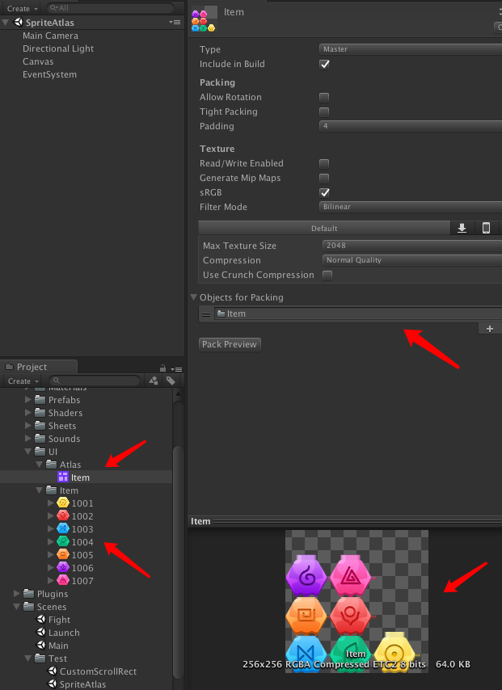
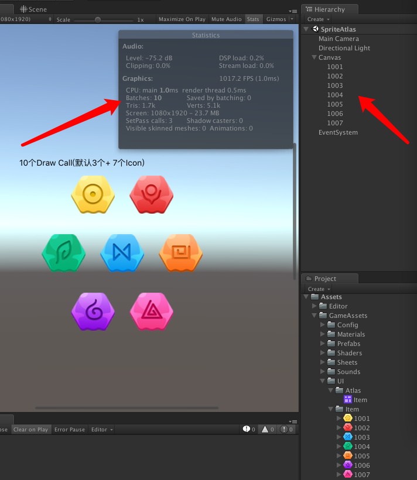
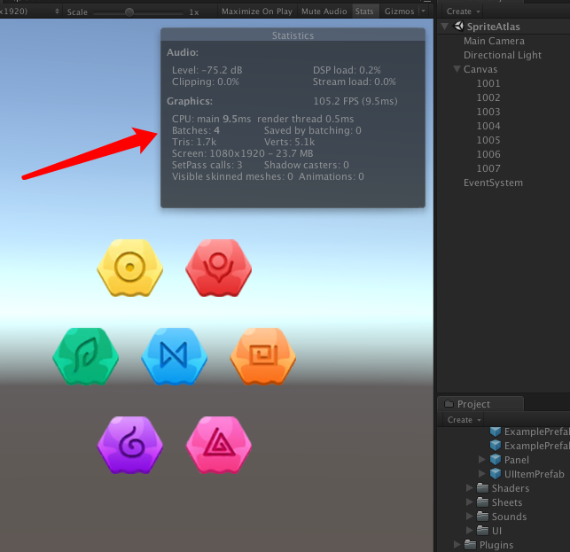

# 图集打包
* 测试场景：Scenes->Test->SpriteAtlas
* 打开Sprite Atlas: Edit > Project Setting > Editor > Sprite Packer > Mode > Always Enabled
* SpriteAtlas和其关联的所有资源打成一个AssetBundle包
* 建立AssetBundle依赖映射时，如果依赖的Sprite有对应的图集，就改为依赖SpriteAtlas
* 大尺寸图片不要关联SpriteAtlas（尺寸界限视具体项目而定）
* 正常Atlas加载Sprite的流程：先加载SpriteAtlas，加载获取GetSprite()。但测试发现，正常直接加载Sprite，一样能关联SpriteAtlas

## SpriteAtlas使用

## 不使用图集的Draw Call结果

## 使用图集的Draw Call合并效果

