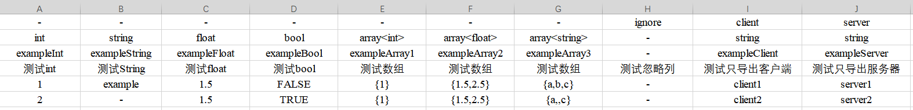

# 表格数据

### 转表
* Tools->Sheet->ExportBytes
* Tools->Sheet->ExportLua

### 使用事项
* Excels/xlsx: excel表格目录
    - excel 的前四行用于结构定义, 其余则为数据
    - 第一行：'-' | 'ignore' | 'client' | 'server' 
    - 第二行：类型 支持 int float string bool array
    - 第三行：关键字
    - 第四行：注释

### Excel示例

### Bytes数据

### Lua数据
~~~lua
local Example = {
    [1]={exampleInt=1,exampleString="example",exampleFloat=1.5,exampleBool=false,exampleArray1={1},exampleArray2={1.5,2.5},exampleArray3={"a","b","c"},exampleServer="server1"},
    [2]={exampleInt=2,exampleString="-",exampleFloat=1.5,exampleBool=true,exampleArray1={1},exampleArray2={1.5,2.5},exampleArray3={"a","","c"},exampleServer="server2"},
}
return Example
~~~

### 注意
* excel必须是xlsx，必须关闭表格才能转表
* 示例项目用Bytes演示支持client数据，lua演示支持server数据用来测试客户端和服务器数据区分功能