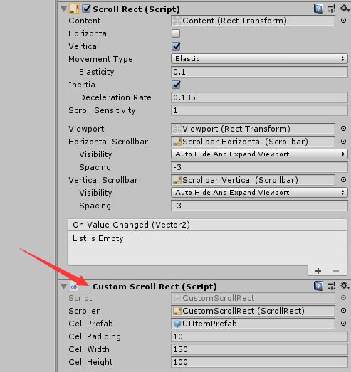
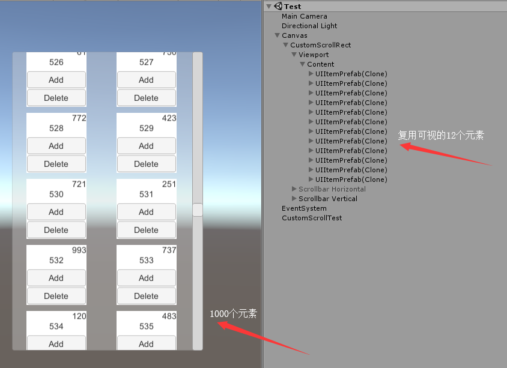

# 无限循环列表
* 测试场景：Scenes->Test->CustomScrollRectTest
* 支持两种常规滚动列表：自左向右的横向滚动和自上向下的纵向滚动列表
* 支持单行或单列多个元素
* 支持添加和删除
* 建议直接挂在ScrollRect同层

## 核心代码
~~~C#
/// 

/// 滑动
/// 

public void OnValueChanged(Vector2 pos)
{
    var index = GetPosIndex();
    if (mIndex != index && index > -1)
    {
        mIndex = index;
        // 处理可视窗口外的Item
        for (var i = mItemList.Count; i > 0; i--)
        {
            var item = mItemList[i - 1];
            if (item.Index < index * mPerLineCellNum || (item.Index >= (index + mViewCount) * mPerLineCellNum))
            {
                mItemList.Remove(item);
                mUnUsedQueue.Enqueue(item);
            }
        }
        // 处理可视窗口内的Item
        for (var i = mIndex * mPerLineCellNum; i < (mIndex + mViewCount) * mPerLineCellNum; i++)
        {
            if (i < 0) continue;
            if (i > mTotal - 1) continue;
            bool inView = false;
            foreach (var item in mItemList)
            {
                if (item.Index == i) inView = true;
            }
            if (inView) continue;
            CreateItem(i);
        }
    }
}
~~~

## 参数设置

## 测试结果
