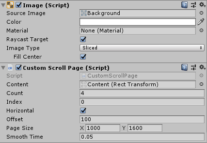
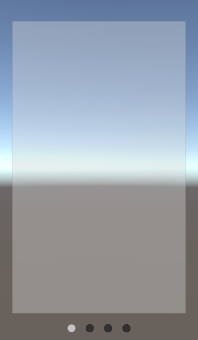

# 翻滚页
* 测试场景：Scenes->Test->CustomScrollPageTest
* 暂时支持从左到右的横向滚动页

## 核心代码
~~~C#
/// 

/// 拖动结束后判断是否翻页
/// 

public override void OnEndDrag(PointerEventData eventData)
{
    var delta = eventData.position - eventData.pressPosition;
    if (Horizontal)
    {
        if (delta.x > Offset && Index > 0)
        {
            Index--;
            if (OnPageAction != null) OnPageAction(Index);
        }
        else if (delta.x < -Offset && Index < Count - 1)
        {
            Index++;
            if (OnPageAction != null) OnPageAction(Index);
        }
    }
    else
    {
        // todo
    }
    mNeedMove = true;
}

/// 

/// 回到正确的页面上
/// 

private void Update()
{
    if (!mNeedMove) return;
    var targetPosX = -PageSize.x * Index - PageSize.x * 0.5f;
    var curPosX = Content.localPosition.x;
    if (Mathf.Abs(targetPosX - curPosX) > 1)
    {
        var x = Mathf.SmoothDamp(curPosX, targetPosX, ref mSmoothSpeed, SmoothTime);
        Content.localPosition = new Vector3(x, Content.localPosition.y, 0);
    }
    else
    {
        mNeedMove = false;
        Content.localPosition = new Vector3(targetPosX, Content.localPosition.y, 0);
    }
}
~~~

## 参数设置

## 测试结果
