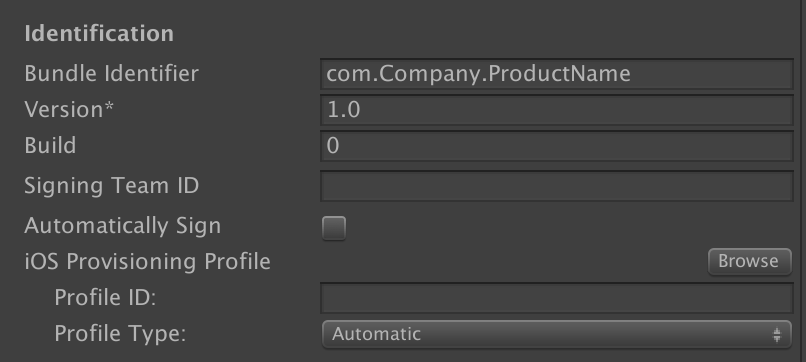

# Jenkins管理打包
* [官网下载](https://jenkins.io)

## 注意事项和建议
* Jenkins默认安装在/Users/Shared/Jenkins，并没有自己用户的权限，最好修改主目录到登录用户下
* 少用Jenkins插件，能写在shell里的尽量写在shell里面
* 整个打包流程我都没有优化，基本上都是删除原来工程，重新生成新工程

## C#构建核心代码
~~~C#
using UnityEditor;
using System.Collections.Generic;

public class BuildScript
{
    /// 

    /// 打包的场景列表
    /// 

    private static string[] GetBuildScenes()
    {
        List<string> names = new List<string>();
        foreach (var scene in EditorBuildSettings.scenes)
        {
            if (scene == null) continue;
            if (scene.enabled) names.Add(scene.path);
        }
        return names.ToArray();
    }

    /// 

    /// 获得shell传入的参数
    /// 

    /// <returns>The arguments.</returns>
    private static Dictionary<string, string> GetArgs()
    {
        var args = new Dictionary<string, string>();
        foreach (string arg in System.Environment.GetCommandLineArgs())
        {
            if (arg.StartsWith("@"))
            {
                var splitIndex = arg.IndexOf("=");
                args.Add(arg.Substring(1, splitIndex - 1), arg.Substring(splitIndex + 1));
            }
        }
        return args;
    }

    /// 

    /// Builds for android.
    /// 

    public static void BuildForAndroid()
    {
        var args = GetArgs();
        PlayerSettings.productName = args["name"];
        PlayerSettings.bundleVersion = args["version"];
        EditorUserBuildSettings.SwitchActiveBuildTarget(BuildTargetGroup.Android, BuildTarget.Android);
        AssetBundleBuilder.Build();
        BuildPipeline.BuildPlayer(GetBuildScenes(), args["out"], BuildTarget.Android, BuildOptions.None);
    }
}
~~~

## Jenkins打包Android
* 项目名、项目路径、版本号配置在Jenkins的参数化构建里
~~~sh
#!/bin/bash
cd $PROJECT_PATH
#Git重置本地变化 拉取远程
git clean -df
git reset --hard
git pull
#UNITY程序的路径
UNITY_PATH=/Applications/Unity/Unity.app/Contents/MacOS/Unity
#导出路径
OUT_PATH=Builds/$PROJECT_NAME$VERSION.apk
#构建项目
$UNITY_PATH -projectPath $PROJECT_PATH -batchmode -executeMethod BuildScript.BuildForAndroid @out=$OUT_PATH @name=$PROJECT_NAME @version=$VERSION -quit
if [ $? -eq 0 ]; then
    echo "Unity build success"
else
    echo "Unity build failed"
    exit 1
fi

#上传fir.im
echo "Upload to fir.im start"
fir publish $OUT_PATH -T ${FIRIM_TOKEN}
if [ $? -eq 0 ]; then
    echo "Upload to fir.im success"
else
    echo "Upload to fir.im failed"
    exit 1
fi

echo "Done!"
~~~

## Jenkins打包IOS
* ExportOptionsPlist：手动导出IPA一次，自动生成
* 密钥证书管理插件：Keychains and Provisioning Profiles Management
* 上述插件我用的时候下拉不下来证书的选择，所以我是在Unity设置中先设置好证书相关

~~~sh
#!/bin/bash
cd $PROJECT_PATH
#Git重置本地变化 拉取远程
git clean -df
git reset --hard
git pull
#UNITY程序的路径
UNITY_PATH=/Applications/Unity/Unity.app/Contents/MacOS/Unity

#导出Xcode的工程路径
XCODE_EXPORT_PATH=/Users/zhengchenyang/Empty/Builds/Xcode/${PROJECT_NAME}
if [ -d ${XCODE_EXPORT_PATH} ];then
	rm -rf ${XCODE_EXPORT_PATH}
	echo "删除Xcode工程"
fi

#导出Xcode工程
$UNITY_PATH -projectPath $PROJECT_PATH -batchmode -executeMethod BuildScript.BuildForIOS @out=$XCODE_EXPORT_PATH -quit
if [ $? -eq 0 ]; then
    echo "Unity build success"
else
    echo "Unity build failed"
    exit 1
fi

#########################编译导出IPA#########################
SCHEMENAME="Unity-iPhone"         #项目scheme名
IPAPATH=$IPA_EXPORT_PATH/$VERSION #打包目标路径

if [ -d ${IPAPATH} ];then
	rm -rf ${IPAPATH}
	echo "删除Archive工程"
fi

#clean
xcodebuild clean -project $XCODE_EXPORT_PATH/$SCHEMENAME.xcodeproj -scheme $SCHEMENAME -configuration $CONFIGURATION

#archive
xcodebuild archive -project $XCODE_EXPORT_PATH/$SCHEMENAME.xcodeproj -scheme $SCHEMENAME -configuration $CONFIGURATION -archivePath $IPAPATH/$SCHEMENAME.xcarchive

#export
xcodebuild -exportArchive -archivePath $IPAPATH/$SCHEMENAME.xcarchive -exportPath $IPAPATH -exportOptionsPlist $EXPORTOPTIONS_PLIST_PATH

#upload
fir publish $IPAPATH/$SCHEMENAME.ipa -T ${FIRIM_TOKEN}
if [ $? -eq 0 ]; then
    echo "Upload to fir.im success"
else
    echo "Upload to fir.im failed"
    exit 1
fi

echo "Done!"
~~~