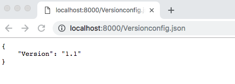

# 构建本地服务器
* [Node.js入门](https://github.com/wugui0220/BLOG)

## 环境准备
- node
- npm
```sh
npm install koa2
npm install koa-static
```

## Server/app.js
``` js
const path = require('path')
const koa = require('koa2')
const static = require('koa-static')

// 创建koa实例
const app = new koa()

// 配置静态资源加载中间件
app.use(static(path.join(__dirname, './public')))

app.listen(8000)
```

## 测试
### 执行脚本
```sh
node app.js
```
### 访问结果


### 以上的静态资源服务器已经可以用来测试热更新
***
***
### Protobuf网络通信

