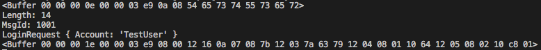

# 本地服务器
* [Node.js参考](https://github.com/wugui0220/BLOG)
* 服务器只作为测试而用

## 环境准备
- node
- yarn(或npm)
```sh
yarn add protobufjs
```
## Server/server.js
``` js
const net = require('net')
const protobuf = require("protobufjs")
const root = protobuf.loadSync("./proto/Example.proto")
const message = root.lookupType("Proto.Example")

const server = net.createServer((socket) => {
    socket.on('data', (buffer) => {
        // 收到客户端消息
        console.log(message.decode(buffer))
        // 响应一条数据测试
        var respond = message.create({ ExampleInt: -1, ExampleFloat: -2.5, ExampleString: 'cba', ExampleArray: [ { ItemDouble: 1.2, ItemBool: true } ] })
        socket.write(message.encode(respond).finish())
    })
})

server.listen(3000)
```

## 执行脚本
```sh
node server.js
```
## 服务器接受到的数据
